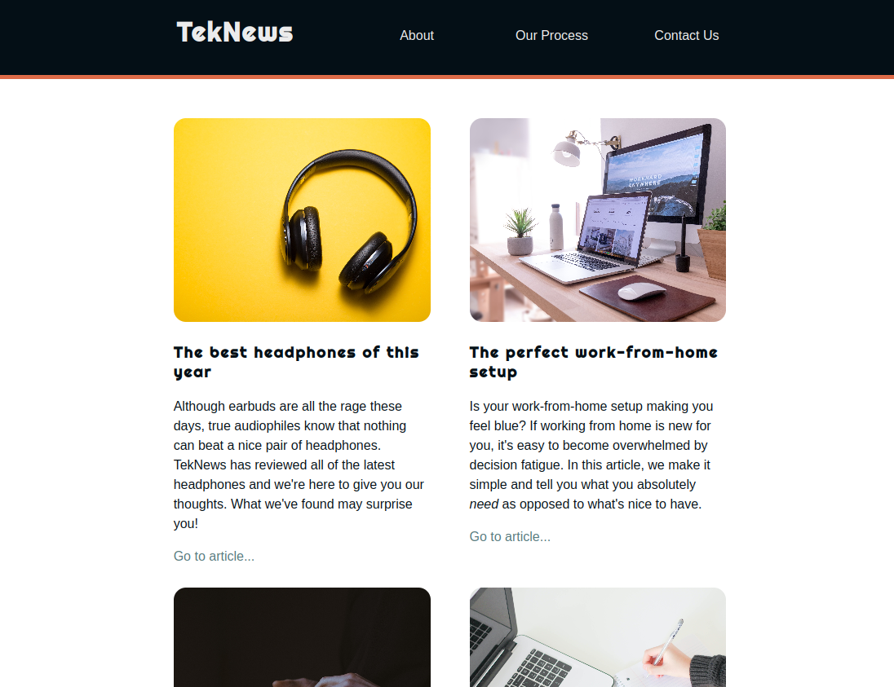
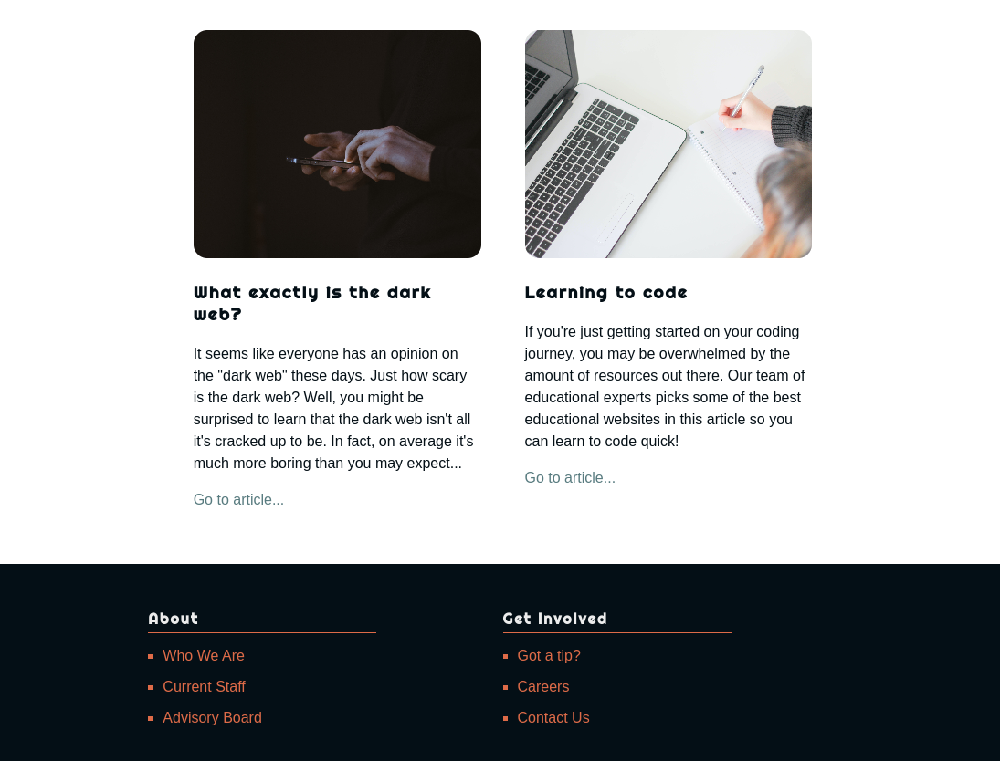
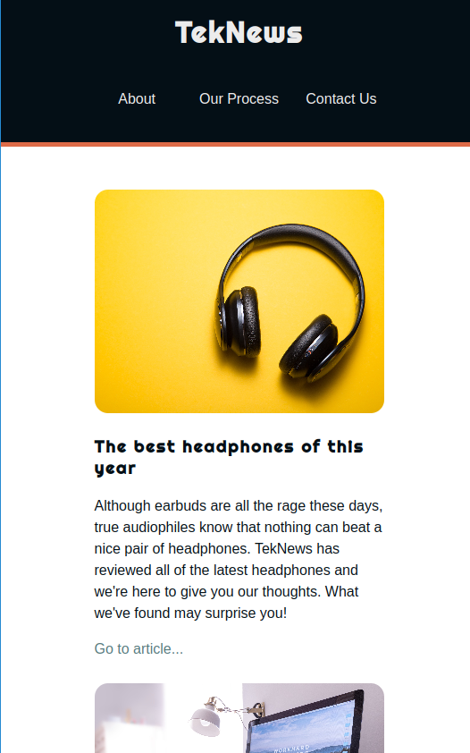
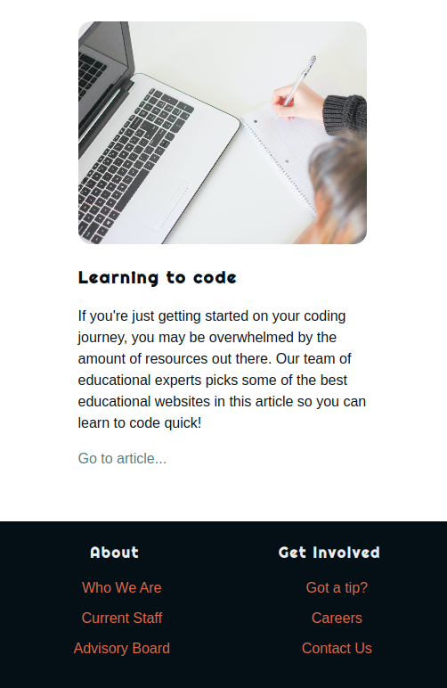

# Holy Media Queries, Batman!

Let's fix up this site to be responsive. With media queries!

### Setup

Fork and clone the repository, navigate into the repo's directory, and run `code .` to start working on it!

Always highly recommended for web app coding: running Live Server to see what happens as you code.

**Especially highly recommended for RESPONSIVE web app coding**: make sure you can resize your browser's window to check the layouts at different widths!

### Instructions

Complete the below tasks using Media Queries. **The Mobile View is a bonus** (_not assigned_), but push yourself to do it (if you don't owe other work).

##### Tablet View ()768px to 1279px)

- Hide the `.splash` section by changing the `display` property to `none`.
- Set the width of the `main` element to be `90%`.
- Update the `footer` element so that instead of three columns it is set to have two.

The result should look like this:

**Header** changes:

**Footer** changes:

##### Mobile View (less than 768px)

- Update the `header` element so that instead of two columns it is set to have one.
- Update the `main` element so that instead of two columns it is set to have one.
- Change the `gap` on the `main` element so that it has a gap between each row of `50px`. The gap between columns should be `0`.
- Update the `footer` element so it has a padding of `25px` all around.
- Update the `footer` element so that all of the text inside of it is aligned to the center.
- Update the `footer` unordered list elements so that none of them have a list-style.
- Update the `footer` heading so that it no longer has a border along the bottom.

The result should look like this:

**Header** changes:

**Footer** changes:

